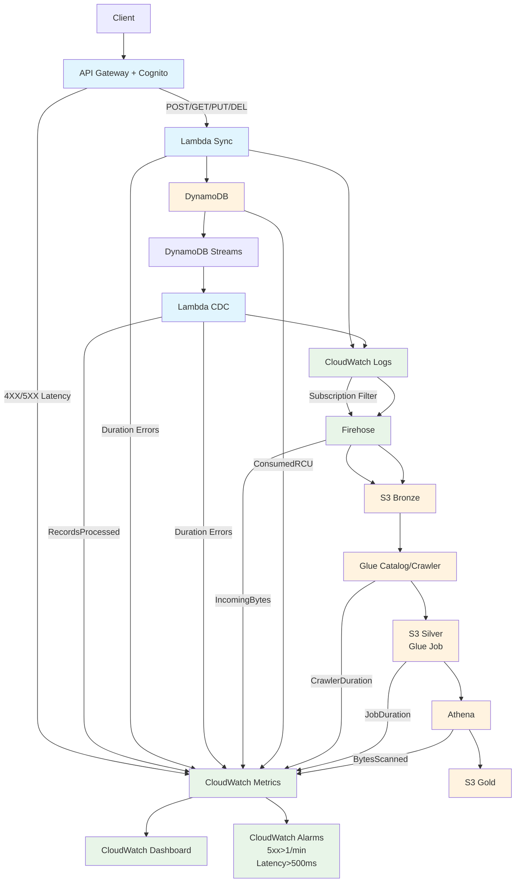

# Todo API with Insights

[](https://aws.amazon.com/)
[](https://python.org/)
[](https://fastapi.tiangolo.com/)
[](https://docs.aws.amazon.com/cdk/)
[](LICENSE)

A production-ready serverless To-Do API with comprehensive data analytics pipeline built on AWS. This project demonstrates modern cloud architecture patterns, Infrastructure as Code, and data lake implementation following AWS Well-Architected Framework principles.

## 🚀 Features

### Core API
- **RESTful API**: FastAPI-based To-Do application with automatic OpenAPI documentation
- **Authentication**: JWT-based authentication with AWS Cognito
- **Data Persistence**: DynamoDB with single-table design and On-Demand capacity
- **Idempotency**: Duplicate request handling with TTL-based cleanup
- **5-Layer Architecture**: Entrypoint → Controller → Service → Repository → Database

### Data Analytics Pipeline
- **Real-time CDC**: DynamoDB Streams → Lambda → Firehose → S3 Bronze
- **Data Lake**: Bronze (raw) → Silver (transformed) → Gold (analytics) layers
- **ETL Processing**: AWS Glue Spark jobs for data transformation
- **Analytics**: Athena-based SQL queries on S3 data
- **Business Metrics**: Custom CloudWatch metrics and KPIs

### Monitoring & Observability
- **Comprehensive Dashboards**: CloudWatch dashboards with API and ETL metrics
- **Structured Logging**: JSON logs with correlation IDs across components
- **Alerting**: CloudWatch alarms with SNS notifications
- **Custom Metrics**: Business KPIs (users, tasks, completion rates)

### Infrastructure as Code
- **AWS CDK**: Python-based infrastructure definition
- **Multi-Stack Architecture**: Data, API, ETL, and Monitoring stacks
- **Resource Tagging**: Project, Owner, Environment, CostCenter
- **Least-Privilege IAM**: Granular permissions and security policies

## 🏗️ Architecture



## 📁 Project Structure

```
todo-api-with-insights/
├── api/                          # FastAPI application
│   ├── src/                      # Source code
│   │   ├── controllers/          # API controllers
│   │   │   ├── task_controller.py
│   │   │   └── user_controller.py
│   │   ├── services/             # Business logic
│   │   │   ├── task_service.py
│   │   │   ├── user_service.py
│   │   │   ├── auth_service.py
│   │   │   └── idempotency_service.py
│   │   ├── repositories/         # Data access layer
│   │   │   ├── task_repository.py
│   │   │   ├── user_repository.py
│   │   │   └── idempotency_repository.py
│   │   ├── models/               # Pydantic models
│   │   │   ├── task_models.py
│   │   │   ├── user_models.py
│   │   │   └── idempotency_models.py
│   │   ├── utils/                # Utility functions
│   │   │   ├── auth_utils.py
│   │   │   └── response_utils.py
│   │   ├── middleware/           # Custom middleware
│   │   ├── dependencies.py       # FastAPI dependencies
│   │   └── main.py               # FastAPI application entry point
│   ├── tests/                    # Test suite
│   │   ├── unit/                 # Unit tests (13 files)
│   │   ├── integration/          # Integration tests (3 files)
│   │   ├── fixtures/             # Test data
│   │   ├── helpers/              # Test utilities
│   │   └── scripts/              # Test automation scripts
│   ├── lambda_entry.py           # Lambda entry point
│   ├── requirements.txt          # Dependencies
│   ├── requirements-dev.txt      # Dev dependencies
│   ├── pyproject.toml            # Linting config
│   ├── mypy.ini                  # Type checking config
│   └── Makefile                  # Build automation
├── etl/                          # ETL pipeline
│   ├── glue_jobs/                # Glue Spark jobs
│   │   ├── silver_transformation/ # Bronze → Silver
│   │   │   ├── silver_transformation.py
│   │   │   └── requirements.txt
│   │   └── gold_analytics/       # Silver → Gold
│   │       ├── gold_analytics.py
│   │       └── requirements.txt
│   ├── lambda_cdc/               # CDC processing
│   │   ├── src/
│   │   │   └── cdc_handler.py
│   │   ├── tests/
│   │   └── requirements.txt
│   ├── lambda_custom_metrics/     # Business metrics
│   │   └── src/
│   │       └── custom_metrics.py
│   ├── shared/                    # Shared utilities
│   │   ├── schemas/
│   │   └── utils/
│   ├── tests/                     # ETL tests
│   ├── requirements.txt           # ETL dependencies
│   ├── requirements-dev.txt       # ETL dev dependencies
│   └── pyproject.toml             # ETL config
├── infra/                        # Infrastructure as Code
│   ├── stacks/                   # CDK stacks
│   │   ├── data_stack.py         # DynamoDB
│   │   ├── api_stack.py          # API Gateway, Lambda, Cognito
│   │   ├── etl_stack.py          # S3, Firehose, Glue, Athena
│   │   └── monitoring_stack.py   # CloudWatch, SNS
│   ├── scripts/                  # Testing scripts
│   │   ├── test-api.ps1          # PowerShell API testing
│   │   ├── test-api.sh           # Bash API testing
│   │   ├── test-etl.ps1          # PowerShell ETL testing
│   │   ├── test-etl.sh           # Bash ETL testing
│   │   └── README.md             # Scripts documentation
│   ├── bin/                      # CDK bootstrap
│   ├── app.py                    # CDK application
│   ├── cdk.json                  # CDK configuration
│   └── requirements.txt           # CDK dependencies
├── docs/                         # Documentation
│   ├── adrs/                     # Architecture Decision Records
│   │   ├── 000-architecture-overview.md
│   │   ├── 001-database-selection.md
│   │   ├── 002-database-capacity-mode-selection.md
│   │   ├── 003-data-modeling-approach.md
│   │   ├── 004-api-framework-and-architecture.md
│   │   ├── 005-etl-method.md
│   │   ├── 006-monitoring-observability.md
│   │   ├── 007-iac-tool-selection.md
│   │   └── template.md
│   ├── runbooks/                 # Operational guides
│   │   ├── RUNBOOK.md
│   │   ├── API_LAYER_TESTING.md
│   │   ├── DEPLOYMENT_AND_TESTING.md
│   │   ├── development/          # Development guides
│   │   └── ETL/                  # ETL operations
│   │       ├── ETL_RUNBOOK.md
│   │       └── athena_queries.sql
│   ├── diagrams/                 # Architecture diagrams
│   │   └── System_architecture.md
│   └── changelog.md              # Project changelog
├── .cursor/                      # AI collaboration
│   ├── context.md                # Project context
│   ├── rules/                    # Development rules
│   └── prompts/                  # AI prompts
├── IMPLEMENTATION_REPORT.md      # Comprehensive implementation report
└── README.md                     # This file
```

## 🚀 Quick Start

### Prerequisites

- **AWS CLI** installed and configured
- **CDK CLI** installed: `npm install -g aws-cdk`
- **Python 3.8+** for local development
- **curl** or **Postman** for API testing
- **jq** for JSON parsing (optional but recommended)

### 1. Clone Repository

```bash
git clone https://github.com/CoreosG/todo-api-with-insights
cd todo-api-with-insights
```

### 2. Deploy Infrastructure

```bash
# Bootstrap CDK (first time only)
cdk bootstrap aws://YOUR-ACCOUNT-ID/us-east-1

# Navigate to infrastructure directory
cd infra

# Activate CDK virtual environment
.\venv-infra\Scripts\Activate.ps1  # Windows
# source venv-infra/bin/activate    # Linux/Mac

# Deploy all stacks
cdk deploy TodoDataStack --require-approval never
cdk deploy TodoApiStack --require-approval never
cdk deploy TodoEtlStack --require-approval never
cdk deploy TodoMonitoringStack --require-approval never
```

### 3. Test API

#### Using Automated Scripts

**PowerShell (Windows):**
```powershell
cd infra\scripts

# Set environment variables
$Env:API_ENDPOINT = "https://YOUR-API-ID.execute-api.us-east-1.amazonaws.com"
$Env:USER_POOL_ID = "us-east-1_YOUR-USER-POOL-ID"
$Env:CLIENT_ID = "YOUR-CLIENT-ID"
$Env:REGION = "us-east-1"
$Env:NON_INTERACTIVE = "1"

# Run API testing
./test-api.ps1
```

**Bash (Linux/Mac):**
```bash
cd infra/scripts

# Set environment variables
export API_ENDPOINT="https://YOUR-API-ID.execute-api.us-east-1.amazonaws.com"
export USER_POOL_ID="us-east-1_YOUR-USER-POOL-ID"
export CLIENT_ID="YOUR-CLIENT-ID"
export REGION="us-east-1"
export NON_INTERACTIVE=1

# Make script executable (first time only)
chmod +x test-api.sh

# Run API testing
./test-api.sh
```

#### Manual Testing

```bash
# Test health endpoint
curl -X GET https://YOUR-API-ID.execute-api.us-east-1.amazonaws.com/health

# Create Cognito user
aws cognito-idp admin-create-user \
  --user-pool-id $USER_POOL_ID \
  --username testuser@example.com \
  --user-attributes Name=email,Value=testuser@example.com \
  --message-action SUPPRESS \
  --region us-east-1

# Authenticate and get token
AUTH_RESPONSE=$(aws cognito-idp admin-initiate-auth \
  --user-pool-id $USER_POOL_ID \
  --client-id $CLIENT_ID \
  --auth-flow ADMIN_NO_SRP_AUTH \
  --auth-parameters USERNAME=testuser@example.com,PASSWORD=TempPassword123! \
  --region us-east-1)

ID_TOKEN=$(echo $AUTH_RESPONSE | jq -r '.AuthenticationResult.IdToken')

# Create task
curl -X POST \
  https://YOUR-API-ID.execute-api.us-east-1.amazonaws.com/api/v1/tasks \
  -H "Authorization: Bearer $ID_TOKEN" \
  -H "Content-Type: application/json" \
  -H "Idempotency-Key: test-task-123" \
  -d '{
    "title": "Test Task",
    "description": "This is a test task",
    "priority": "medium",
    "category": "testing"
  }' | jq .
```

### 4. Test ETL Pipeline

```bash
# Generate ETL test data
cd infra/scripts

# PowerShell (Windows)
$Env:NUM_USERS = "3"
$Env:TASKS_PER_USER = "5"
$Env:UPDATES_PER_TASK = "3"
./test-etl.ps1

# Bash (Linux/Mac)
export NUM_USERS="3"
export TASKS_PER_USER="5"
export UPDATES_PER_TASK="3"
./test-etl.sh

# Run Glue jobs
aws glue start-job-run --job-name todo-silver-transformation --region us-east-1
aws glue start-job-run --job-name todo-gold-analytics --region us-east-1

# Query analytics data
aws athena start-query-execution \
  --query-string "SELECT COUNT(*) as total_users FROM user_analytics" \
  --query-execution-context Database=todo_analytics \
  --result-configuration OutputLocation=s3://todo-gold-YOUR-ACCOUNT-us-east-1/athena-results/ \
  --region us-east-1
```

## 📊 Monitoring

### CloudWatch Dashboard

Access the comprehensive monitoring dashboard:
```
https://console.aws.amazon.com/cloudwatch/home?region=us-east-1#dashboards:name=TodoApiMonitoring
```

**Dashboard Sections:**
- **API Health**: Request counts, errors, latency
- **Lambda Performance**: Duration, errors, throttles
- **ETL Pipeline**: Job success rates, data ingestion
- **Database Performance**: Capacity usage, throttling
- **Business Metrics**: Users, tasks, completion rates
- **Cost Monitoring**: Service costs by AWS service

### Key Metrics

#### API Metrics
- Request count and error rates
- API Gateway latency (P50, P95, P99)
- Lambda function duration and errors
- Authentication success/failure rates

#### ETL Metrics
- DynamoDB Streams processing lag
- Firehose delivery success rates
- Glue job execution times and success rates
- Data lake storage usage and costs

#### Business Metrics
- Total users and active users
- Total tasks and completion rates
- Task distribution by category and priority
- User engagement patterns

### Alarms

#### Critical Alarms
- API error rate > 10 4XX errors
- Lambda errors > 5 errors
- Lambda duration > 5000ms
- Firehose delivery failures
- Glue job failures

#### Cost Alarms
- DynamoDB costs > $50
- Lambda costs > $20
- S3 storage costs > $100

## 🧪 Testing

### Test Coverage

#### API Tests
- **Unit Tests**: 13 test files covering all components
- **Integration Tests**: 3 test files for end-to-end testing
- **API Gateway Tests**: Mocked service integration tests
- **Database Tests**: Real DynamoDB integration tests

#### ETL Tests
- **CDC Handler Tests**: DynamoDB Streams processing
- **Custom Metrics Tests**: Business metrics collection
- **Glue Job Tests**: Data transformation logic
- **End-to-End Tests**: Complete pipeline validation

### Running Tests

#### API Tests
```bash
cd api

# Activate virtual environment
.\venv-api\Scripts\Activate.ps1  # Windows
# source venv-api/bin/activate    # Linux/Mac

# Install dependencies
pip install -r requirements.txt -r requirements-dev.txt

# Run unit tests
python -m pytest tests/unit/ -v

# Run integration tests
python -m pytest tests/integration/ -v

# Run all tests with coverage
python -m pytest --cov=src tests/ -v
```

#### ETL Tests
```bash
cd etl

# Activate virtual environment
.\venv-etl\Scripts\Activate.ps1  # Windows
# source venv-etl/bin/activate    # Linux/Mac

# Install dependencies
pip install -r requirements.txt -r requirements-dev.txt

# Run ETL tests
python -m pytest tests/ -v
```

#### Infrastructure Tests
```bash
cd infra

# Activate virtual environment
.\venv-infra\Scripts\Activate.ps1  # Windows
# source venv-infra/bin/activate    # Linux/Mac

# Install dependencies
pip install -r requirements.txt

# Synthesize CDK templates
cdk synth

# Deploy and test
cdk deploy --all --require-approval never
```

### Linting and Code Quality

#### API Linting
```bash
cd api

# Format code
black src/ tests/

# Lint code
ruff check src/ tests/

# Type checking
mypy src/
```

#### ETL Linting
```bash
cd etl

# Format code
black .

# Lint code
ruff check .

# Type checking
mypy .
```

## 📚 Documentation

### Architecture Decision Records (ADRs)

The project includes comprehensive ADRs documenting all major architectural decisions:

- **[ADR-000: Architecture Overview](docs/adrs/000-architecture-overview.md)** - Overall architecture and design philosophy
- **[ADR-001: Database Selection](docs/adrs/001-database-selection.md)** - DynamoDB selection rationale
- **[ADR-002: Database Capacity Mode](docs/adrs/002-database-capacity-mode-selection.md)** - On-Demand capacity mode decision
- **[ADR-003: Data Modeling Approach](docs/adrs/003-data-modeling-approach.md)** - Single-table design implementation
- **[ADR-004: API Framework Selection](docs/adrs/004-api-framework-and-architecture.md)** - FastAPI and Repository pattern
- **[ADR-005: ETL Method Selection](docs/adrs/005-etl-method.md)** - Hybrid Lambda/Glue ETL pipeline
- **[ADR-006: Monitoring Strategy](docs/adrs/006-monitoring-observability.md)** - CloudWatch monitoring strategy
- **[ADR-007: IaC Tool Selection](docs/adrs/007-iac-tool-selection.md)** - AWS CDK selection and implementation

### Runbooks

- **[Consolidated Runbook](docs/runbooks/CONSOLIDATED_RUNBOOK.md)** - Complete operational guide
- **[API Testing Guide](docs/runbooks/API_LAYER_TESTING.md)** - API testing procedures
- **[Deployment Guide](docs/runbooks/DEPLOYMENT_AND_TESTING.md)** - Deployment and testing procedures
- **[ETL Operations](docs/runbooks/ETL/ETL_RUNBOOK.md)** - ETL pipeline operations guide
- **[Athena Queries](docs/runbooks/ETL/athena_queries.sql)** - Example analytics queries

### Additional Documentation

- **[Implementation Report](IMPLEMENTATION_REPORT.md)** - Comprehensive implementation details
- **[Changelog](docs/changelog.md)** - Project changelog
- **[System Architecture](docs/diagrams/System_architecture.md)** - Architecture diagrams

## 🔧 Development

### Local Development Setup

#### API Development
```bash
cd api

# Create virtual environment
python -m venv venv-api
.\venv-api\Scripts\Activate.ps1  # Windows
# source venv-api/bin/activate    # Linux/Mac

# Install dependencies
pip install -r requirements.txt -r requirements-dev.txt

# Start local DynamoDB (optional)
docker run -d -p 8000:8000 amazon/dynamodb-local

# Run API locally
make serve-local
# Or you can run uvicorn, but you have to setup env vars yourself then
uvicorn src.main:app --reload --host 0.0.0.0 --port 8000

# Visit API documentation
open http://localhost:8000/docs
```

#### ETL Development
```bash
cd etl

# Create virtual environment
python -m venv venv-etl
.\venv-etl\Scripts\Activate.ps1  # Windows
# source venv-etl/bin/activate    # Linux/Mac

# Install dependencies
pip install -r requirements.txt -r requirements-dev.txt

# Run ETL tests
python -m pytest tests/ -v
```

#### Infrastructure Development
```bash
cd infra

# Create virtual environment
python -m venv venv-infra
.\venv-infra\Scripts\Activate.ps1  # Windows
# source venv-infra/bin/activate    # Linux/Mac

# Install dependencies
pip install -r requirements.txt

# Synthesize templates
cdk synth

# Deploy specific stack
cdk deploy TodoDataStack --require-approval never
```

### Code Quality Tools

#### Pre-commit Hooks
```bash
# Install pre-commit
pip install pre-commit

# Install hooks
pre-commit install

# Run hooks manually
pre-commit run --all-files
```

#### Make Commands
```bash
# API make commands
cd api
make lint      # Run linting
make test      # Run tests
make format    # Format code
make typecheck # Type checking

# ETL make commands
cd etl
make lint      # Run linting
make test      # Run tests
make format    # Format code
```

## 🚀 Deployment

### Production Deployment

#### 1. Environment Setup
```bash
# Set environment variables
export CDK_DEFAULT_ACCOUNT="YOUR-ACCOUNT-ID"
export CDK_DEFAULT_REGION="us-east-1"
export ENVIRONMENT="production"
```

#### 2. Deploy Infrastructure
```bash
cd infra

# Bootstrap CDK (first time only)
cdk bootstrap aws://YOUR-ACCOUNT-ID/us-east-1

# Deploy all stacks
cdk deploy --all --require-approval never
```

#### 3. Verify Deployment
```bash
# Check all resources
aws dynamodb list-tables --region us-east-1
aws lambda list-functions --region us-east-1
aws apigatewayv2 get-apis --region us-east-1
aws s3 ls --region us-east-1
```

#### 4. Run Smoke Tests
```bash
cd infra/scripts

# Run API smoke tests
./test-api.sh

# Run ETL smoke tests
./test-etl.sh
```

### CI/CD Pipeline

#### GitHub Actions (Example)
```yaml
name: Deploy
on:
  push:
    branches: [main]

jobs:
  deploy:
    runs-on: ubuntu-latest
    steps:
      - uses: actions/checkout@v3
      - uses: actions/setup-python@v4
        with:
          python-version: '3.11'
      
      - name: Install CDK
        run: npm install -g aws-cdk
      
      - name: Deploy Infrastructure
        run: |
          cd infra
          pip install -r requirements.txt
          cdk deploy --all --require-approval never
        env:
          AWS_ACCESS_KEY_ID: ${{ secrets.AWS_ACCESS_KEY_ID }}
          AWS_SECRET_ACCESS_KEY: ${{ secrets.AWS_SECRET_ACCESS_KEY }}
```

## 🔒 Security

### Security Features

#### Authentication & Authorization
- **JWT Tokens**: Secure token-based authentication
- **Cognito Integration**: Managed user authentication
- **Least Privilege IAM**: Minimal required permissions
- **User-Scoped Data**: Data isolation per user

#### Data Protection
- **Encryption at Rest**: S3 and DynamoDB encryption
- **Encryption in Transit**: TLS/SSL for all communications
- **AWS KMS**: Managed encryption keys
- **Data Masking**: Sensitive data protection

#### Monitoring & Compliance
- **Audit Logging**: Comprehensive access logs
- **Security Monitoring**: Unusual access detection
- **Compliance**: Industry standard compliance
- **Incident Response**: Documented procedures

### Security Best Practices

1. **Never commit secrets** - Use environment variables or AWS Secrets Manager
2. **Regular access reviews** - Monthly IAM permission audits
3. **Monitor access patterns** - CloudWatch security monitoring
4. **Keep dependencies updated** - Regular security updates
5. **Use least privilege** - Minimal required permissions

## 💰 Cost Optimization

### Cost Structure

#### Estimated Monthly Costs (Low Usage)
- **DynamoDB**: ~$5-10 (On-Demand pricing)
- **Lambda**: ~$2-5 (1M requests/month)
- **API Gateway**: ~$3-7 (1M requests/month)
- **S3 Storage**: ~$1-3 (1GB storage)
- **CloudWatch**: ~$2-5 (logs and metrics)
- **Total**: ~$13-30/month

#### Cost Optimization Features
- **S3 Lifecycle Policies**: Automatic data archival
- **DynamoDB On-Demand**: Pay-per-request pricing
- **Lambda Optimization**: Right-sized memory allocation
- **CloudWatch Cost Alerts**: Budget monitoring
- **Resource Tagging**: Cost allocation tracking

### Cost Monitoring

```bash
# Check current costs
aws ce get-cost-and-usage \
  --time-period Start=2025-01-01,End=2025-01-31 \
  --granularity MONTHLY \
  --metrics BlendedCost \
  --region us-east-1

# Set up budget alerts
aws budgets create-budget \
  --account-id YOUR-ACCOUNT-ID \
  --budget '{
    "BudgetName": "TodoAPI-Monthly",
    "BudgetLimit": {"Amount": "50", "Unit": "USD"},
    "TimeUnit": "MONTHLY",
    "BudgetType": "COST"
  }' \
  --region us-east-1
```

## 🤝 Contributing

### Development Workflow

1. **Fork the repository**
2. **Create a feature branch**: `git checkout -b feature/amazing-feature`
3. **Make changes and test**: Follow testing procedures
4. **Run linting**: Ensure code quality
5. **Commit changes**: Use conventional commits
6. **Push to branch**: `git push origin feature/amazing-feature`
7. **Create Pull Request**: Describe changes and testing

### Code Standards

#### Commit Message Format
```
feat(api): add user profile endpoint
fix(etl): resolve Glue job timeout issue
docs(readme): update deployment instructions
refactor(infra): simplify CDK stack dependencies
```

#### Code Style
- **Python**: Follow PEP 8, use Black for formatting
- **Type Hints**: Use mypy for type checking
- **Documentation**: Comprehensive docstrings
- **Testing**: Maintain >80% test coverage

### Pull Request Process

1. **Update documentation** for any API changes
2. **Add tests** for new functionality
3. **Update CHANGELOG.md** with changes
4. **Ensure all tests pass** in CI/CD pipeline
5. **Request review** from maintainers

## 📄 License

This project is licensed under the MIT License - see the [LICENSE](LICENSE) file for details.

## 🙏 Acknowledgments

- **AWS Well-Architected Framework** for architectural guidance
- **FastAPI** team for the excellent web framework
- **AWS CDK** team for Infrastructure as Code capabilities
- **Community** for open-source tools and libraries

## 📞 Support

### Getting Help

- **Documentation**: Check the [runbooks](docs/runbooks/) for operational guidance
- **Issues**: Create GitHub issues for bugs or feature requests
- **Discussions**: Use GitHub Discussions for questions
- **Email**: Contact the development team

### Escalation Procedures

1. **Level 1**: Development Team
2. **Level 2**: DevOps Team
3. **Level 3**: Engineering Management
4. **Level 4**: Executive Team

---

**Built with ❤️ using AWS, Python, and modern cloud architecture patterns.**
