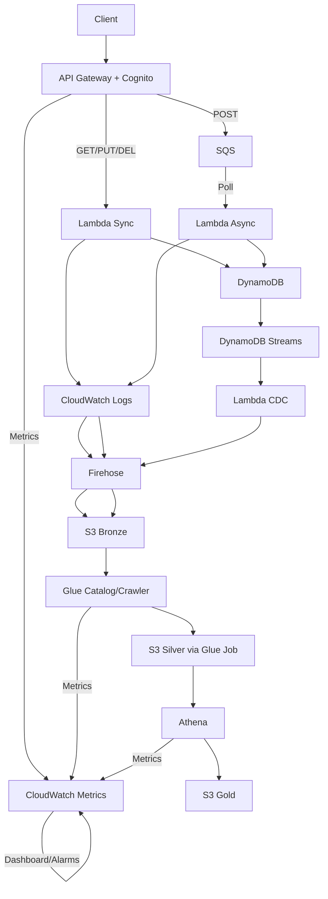

# ADR-000: Architecture Overview and Design Philosophy

## Context
<details>
    <summary>Challenge context</summary>
        # Full‑Stack Candidate Test: Python REST API + AWS Data Lake
        > Build a simple, production‑minded system with a To‑Do REST API in Python, an ETL that lands insights into S3 for Athena, CloudWatch monitoring, and complete IaC. The goal is to evaluate design decisions, documentation, and best practices — not to provide boilerplate code.

        ## 1) Objective
        Develop a **To‑Do API** and a minimal **data lake pipeline** using your preferred approach. You can choose between a **serverless** or **containerized** architecture. Explain your choices clearly through ADRs and documentation.

        ## 2) Requirements Overview
        ### 2.1 REST API
        - Provide basic CRUD endpoints for **Users** (with authentication) and **Tasks**.
        - Tasks must have at least `title` and `description`. You may extend the schema.
        - Implement authentication (JWT, Cognito, or equivalent).
        - Ensure proper input validation and documentation (e.g., OpenAPI/Swagger).

        ### 2.2 Database
        - Use any data store (relational or NoSQL) you prefer.
        - Justify your choice in the documentation (performance, scalability, simplicity, etc.).

        ### 2.3 ETL / Data Lake
        - Implement a lightweight ETL or data‑processing job that extracts task‑level data and writes insights to **Amazon S3**.
        - Enable **Athena** queries or similar analytical access to that data.
        - Choose and justify your preferred method (Glue, Lambda, Step Functions, or other pattern).

        ### 2.4 Monitoring
        - Use **CloudWatch** (or equivalent) for metrics, logs, and alarms.
        - Include at least one dashboard summarizing API health and ETL performance.

        ### 2.5 Infrastructure as Code (IaC)
        - Automate infrastructure deployment with your preferred IaC tool (Terraform, CDK, CloudFormation, Pulumi, etc.).
        - Ensure a single command or minimal set of steps can deploy the full stack.

        ### 2.6 Documentation
        Provide a `docs/` folder containing:
        - **README** — project overview and deployment steps.
        - **ADRs** — rationale for key architectural decisions.
        - **Runbook** — how to run, test, and troubleshoot.
        - **Architecture Diagram** — a simple diagram showing core components.

        ---

        ## 3) Design Guidance
        You are encouraged to review and apply software engineering best practices rather than copying example code. Some recommended readings:

        - [The Twelve‑Factor App](https://12factor.net/)
        - [Domain‑Driven Design Reference](https://dddcommunity.org/learning-ddd/)
        - [Microservices Patterns](https://microservices.io/patterns/index.html)
        - [AWS Well‑Architected Framework](https://docs.aws.amazon.com/wellarchitected/latest/framework/welcome.html)
        - [Event‑Driven Architecture](https://docs.aws.amazon.com/whitepapers/latest/event-driven-architecture/welcome.html)
        - [ETL and Data Lake Design Patterns](https://docs.aws.amazon.com/whitepapers/latest/building-data-lakes/building-data-lakes.html)
        - [Testing in Python](https://docs.pytest.org/)

        Focus on **clear reasoning**, **simplicity**, and **documentation**.

        ---

        ## 4) Evaluation Criteria (100 pts)
        | Area | Points |
        |------|---------|
        | Architecture rationale (ADRs, diagrams) | 25 |
        | API design & correctness | 20 |
        | Data modeling & persistence | 15 |
        | ETL / Athena integration | 15 |
        | Observability (metrics, dashboards) | 10 |
        | IaC completeness | 10 |
        | Documentation & readability | 5 |

        ---

        ## 5) Repository Expectations
        ```
        .
        ├─ api/             # Application code
        ├─ etl/             # ETL or data processing job
        ├─ infra/           # IaC (Terraform/CDK/etc.)
        ├─ docs/            # ADRs, diagrams, and runbook
        └─ .github/         # Optional CI/CD workflows
        ```

        Avoid boilerplate or copy‑paste templates. Instead, demonstrate **your architectural reasoning** and **research depth**.

        ---

        ## 6) Deliverables
        1. Working API and ETL job.
        2. Deployable infrastructure via IaC.
        3. CloudWatch monitoring and dashboard.
        4. Complete documentation and ADRs.
        5. Clear, small, conventional commits.

        ---

        ## 7) Notes
        - Keep the design **simple, maintainable, and observable**.
        - Do **not** include unnecessary complexity (e.g., canary releases, advanced CI/CD, or A/B testing).
        - Demonstrate professional engineering judgment and awareness of cloud-native best practices.

        ---

        ## 8) Cursor & LLM Collaboration Practices
        **Goal:** make your thought process and changes auditable. When using AI assistance (Cursor/LLMs), document how you worked.

        ### 8.1 Folder & Files
        - Create a `.cursor/` directory with:
        - `rules` — conventions that guide AI assistance (see examples below).
        - `prompts/` — **important prompts** you used (one file per task/feature). Name them clearly, e.g., `auth-login.md`, `etl-partitioning.md`.
        - `context.md` — (optional) quick project context for AI tools.

        ### 8.2 What to capture in `./.cursor/prompts/*`
        - The **prompt** you used and, if relevant, the **system/instructions** you gave the model.
        - A short note on **why** you asked it (what you were trying to achieve).
        - Any **constraints** (perf, cost, security) and how you validated the output.
        - Link to the **commit(s)** that implemented the suggestion.

        > Rationale: even if a feature isn’t finished, we value a transparent process and the ability to trace decisions.

        ### 8.3 Example `rules` (keep concise; adapt to your stack)
        ```
        # General
        - Prefer small, incremental changes (< ~200 LOC). If a change exceeds this, split into multiple commits/PRs.
        - Never commit secrets. Use env vars/SSM/Secrets Manager; verify .gitignore.
        - Prioritize readability over cleverness; add docstrings when logic isn’t obvious.

        # Python
        - Framework: document chosen framework in docs/ADRs; expose OpenAPI where possible.
        - Enforce ruff+black+mypy clean before commit (`make lint` must pass).
        - Validate inputs with pydantic (or equivalent) on every API boundary.
        - Write/maintain tests for new endpoints and bug fixes (pytest).

        # Data & ETL
        - Prefer schema evolution–friendly formats (e.g., Parquet). Partition by date (year/month/day) unless justified otherwise.
        - Ensure idempotency for ETL writes; safe retries with exponential backoff.

        # Observability
        - Emit structured logs (JSON). Include request_id and user_id when available.
        - Expose minimal, meaningful metrics for API and ETL.

        # Infra
        - Tag all resources: Project, Owner, Environment, CostCenter.
        - Least-privilege IAM. Plan/review before apply. Provide teardown instructions.
        ```

        ### 8.4 Useful references for rules & practices
        - Cursor docs: https://docs.cursor.com/
        - Prompt engineering (intro): https://www.promptingguide.ai/
        - Conventional Commits: https://www.conventionalcommits.org/en/v1.0.0/
        - Semantic Versioning: https://semver.org/
        - Keep a Changelog: https://keepachangelog.com/en/1.1.0/
        - Git book (best practices): https://git-scm.com/book/en/v2
        - GitHub Flow: https://docs.github.com/en/get-started/using-github/github-flow
        - Python quality:
        - Ruff: https://docs.astral.sh/ruff/
        - Black: https://black.readthedocs.io/
        - MyPy: https://mypy.readthedocs.io/
        - Pytest: https://docs.pytest.org/
        - AWS references:
        - CloudWatch dashboards: https://docs.aws.amazon.com/AmazonCloudWatch/latest/monitoring/CloudWatch_Dashboards.html
        - Glue & Data Catalog: https://docs.aws.amazon.com/glue/latest/dg/what-is-glue.html
        - Athena: https://docs.aws.amazon.com/athena/latest/ug/what-is.html

        ### 8.5 Git hygiene & commit messaging
        - Use **Conventional Commits** for traceability.
        - Examples:
            - `feat(api): add POST /tasks`
            - `fix(auth): handle expired refresh tokens`
            - `refactor(etl): extract s3 writer`
            - `chore(infra): add CW dashboard widgets`
            - `docs(adr): record db selection rationale`
        - Keep commits **small and focused**; avoid mixing refactors with features.
        - Prefer PRs with a clear **intent** and a short **Context/Decision/Testing** section.

        ### 8.6 Process over outcome
        - If a feature isn’t fully running, that’s okay — document:
        - Alternatives considered (in ADRs).
        - What you validated (POC notes, metrics, local tests).
        - Known gaps and next steps.
        - The ability to **reason, communicate trade‑offs, and learn** is scored highly.

        ---

        ## 9) Deliverables (unchanged)
        1. Working API and ETL job.
        2. Deployable infrastructure via IaC.
        3. CloudWatch monitoring and dashboard.
        4. Complete documentation and ADRs.
        5. Clear, small, conventional commits.
        6. `.cursor/` folder with **rules** and **prompts** documenting AI‑assisted steps.
</details>

- Test requirements summary
    - To-Do API with minimal data lake pipeline
    - serverless or containerized
    - Rest API
        - basic CRUD endpoints for Users (with authentication) and Tasks
        - proper input validation and documentation (openapi/swagger)
    - Database: use any and justify the choice
    - ETL / Data Lake: lightweight ETL extracting task-level data and writing insights to S3
        - Enable Athena queries or similar
        - Choose and  justify preffered  method (glue, lambda, step functions, etc)
    - Monitoring: Cloudwatch for metrics, logs and alarms, at least  one dashboard summarizing API health and ETL performance
    - IaC: Automate infrastructure deployment with single command or minimal set of steps
    - Documentation: docs/ with README, ADRs, Runbook, Architecture Diagram

## Evaluation Criteria (100 pts)
| Area | Points |
|------|---------|
| Architecture rationale (ADRs, diagrams) | 25 |
| API design & correctness | 20 |
| Data modeling & persistence | 15 |
| ETL / Athena integration | 15 |
| Observability (metrics, dashboards) | 10 |
| IaC completeness | 10 |
| Documentation & readability | 5 |

- Timeline/scope constraints:
    - 10 days (2025-10-24)

## High-Level Design Approach
### 1) Serverless vs Containers:
| Topic | Serverless | Containers | Rationale |
|------|---------| ----- | ---- |
| Simplicity vs Complexity | High Simplicity. AWS manages the underlying infrastructure, patching, and scaling. Developer focus remains on code (e.g., Lambda handlers). | High Complexity. Requires managing container images, orchestration (ECS/EKS), scaling policies, and host patching. Higher cognitive load. | Serverless maximizes simplicity and reduces the operational burden, scoring high on the "maintainable" requirement.
|Cost Optimization |Pay-per-execution. Cost is zero when idle and scales precisely with usage. Highly favorable for a minimal To-Do application. | Pay-for-provisioned capacity | Serverless is inherently more cost-efficient for low-to-moderate, bursty/unknown workloads.
| Scalability | Automatic, Elastic, and Instant. Scales from zero to high concurrency transparently. | Requires configuration (Auto Scaling Groups, Fargate profiles, or Kubernetes HPA). Slower to react from zero. | Automatic scaling is a core strength of serverless, ensuring high API health and performance under load.
| API/Compute | AWS Lambda integrated with API Gateway. Python runtime. |Amazon ECS/Fargate with an Application Load Balancer (ALB). | Lambda/API Gateway provides built-in authorization (Cognito), request validation, and an immediate response to the request's event-driven nature.
| ETL/Data Processing | DynamoDB SQS/Lambda/Glue. Event-driven and cost-optimized processing | ECS/Fargate tasks scheduled by EventBridge. | Serverless services like DynamoDB Streams and Lambda natively support event-driven pipelines, simplifying the data ingestion side of the Data Lake requirement.
| AWS / Portable considerations | High vendor lock-in, code written for the cloud FaaS model and integrated services | Low lock-in, container images are portable. | Since it's a test scenario, i'll leverage what i can from AWS, apart form that, containers aren't good for this scenario


## Guiding Principles
| Principle | Implementation Strategy |
| :--- | :--- |
| **Production-Ready** | Use managed, scalable AWS services (**S3, DynamoDB, Lambda, Cognito**). Implement robust error handling and structured logging. |
| **Security Posture** | **Least Privilege IAM** for all components. Use **AWS Cognito** for authentication, removing the need to manage user secrets. Data at rest encryption (DynamoDB and S3 KMS/SSE). |
| **Observability Strategy** | **Structured Logging (JSON)** emitted from Lambda to **CloudWatch Logs**. **CloudWatch Metrics** for API latency, errors, and ETL job execution. **CloudWatch Dashboard** for health summary. |
| **Cost Optimization** | **Serverless** architecture (pay-per-use). Select **DynamoDB** over managed relational databases for simpler, high-scale, low-cost persistence. Optimize ETL to use low-cost services like S3, Athena, and event-triggered Lambda/Glue. |

## Success Criteria
| Criterion | Metric/Verification Method |
| :--- | :--- |
| **All Endpoints Working** | Successful CRUD operations for Users and Tasks. **OpenAPI/Swagger** documentation for validation. |
| **ETL Pipeline Landing Data** | **S3 bucket** contains partitioned task-level data in **Parquet** format. |
| **Athena Query Enabled** | **AWS Glue Data Catalog** table defined over the S3 data. Successful **Athena query** execution. |
| **CloudWatch Dashboard** | Dashboard widgets display **API Error Rate**, **API Latency (P99)**, and **ETL Job Duration/Success** metrics. |
| **Complete IaC Deployment** | Single `cdk deploy` or `terraform apply` command deploys and links all services. |
| **Clear Documentation/ADRs** | Presence of `docs/` folder with required files, including this ADR. |

## System Architecture
| Component | AWS Service | Rationale |
|-----------|-------------|-----------|
| API Gateway + Auth | API Gateway + Cognito | API Gateway handles REST routing, throttling, and caching; Cognito provides JWT-based user pools for secure, managed authentication without custom token handling. Aligns with security best practices (least privilege, no self-managed secrets). |
| Synchronous Operations (CRUD) | Lambda (Sync) | Serverless functions for immediate response to GET/PUT/DEL requests; auto-scales to handle bursts; integrates natively with API Gateway for low-latency execution (<100ms cold starts with provisioned concurrency if needed). |
| Asynchronous Queuing | SQS | Decouples POST task creation from immediate processing; ensures reliable delivery for high-throughput writes; FIFO queue optional for task ordering per user. |
| Asynchronous Processing | Lambda (Async) | Polls SQS for batched task processing; cost-effective for variable loads; enables idempotent writes to DynamoDB with conditional expressions. |
| Persistence | DynamoDB | NoSQL for flexible schema (single-table design: PK=user_id, SK=task_id); auto-scales reads/writes; global tables unnecessary for regional app; cheaper than RDS for sparse, key-value access patterns. |
| Change Data Capture | DynamoDB Streams | Captures real-time inserts/updates/deletes on tasks; low-latency (seconds) for event-driven ETL; shards by partition key for parallel processing. |
| CDC Processing | Lambda (CDC) | Triggers on Streams for insert-only extraction (filter deletes if needed); transforms to Parquet schema; handles failures with DLQ. Event-driven over scheduled for freshness. |
| Logging & Buffering | CloudWatch Logs + Firehose | Logs emit JSON to CW for searchability/metrics; Firehose buffers and transforms to S3 for long-term storage; avoids direct S3 writes for atomicity. |
| Raw Data Storage | S3 (Bronze) | Partitioned Parquet (year/month/day/user_id) for task events; server-side encryption (SSE-KMS); lifecycle policies to Glacier after 90 days. |
| Data Catalog & Crawler | Glue Catalog | Auto-discovers/infers schema from S3; enables Athena federation; versioned tables for schema evolution. |
| Transformation | Glue Job (Silver) | Batch ETL for aggregations (e.g., tasks_per_user_daily); Spark-based for efficiency on small datasets; scheduled via EventBridge. |
| Analytics | Athena + S3 (Gold) | Serverless SQL queries on Silver/Gold; cost-per-query (~$5/TB scanned); Gold as query-optimized (e.g., ORC, sorted columns). |
| Monitoring | CloudWatch (Metrics, Alarms, Dashboard) | Custom metrics (API latency P99, error rate, ETL duration); alarms for >5% errors; dashboard with line/bar widgets for health overview. |
