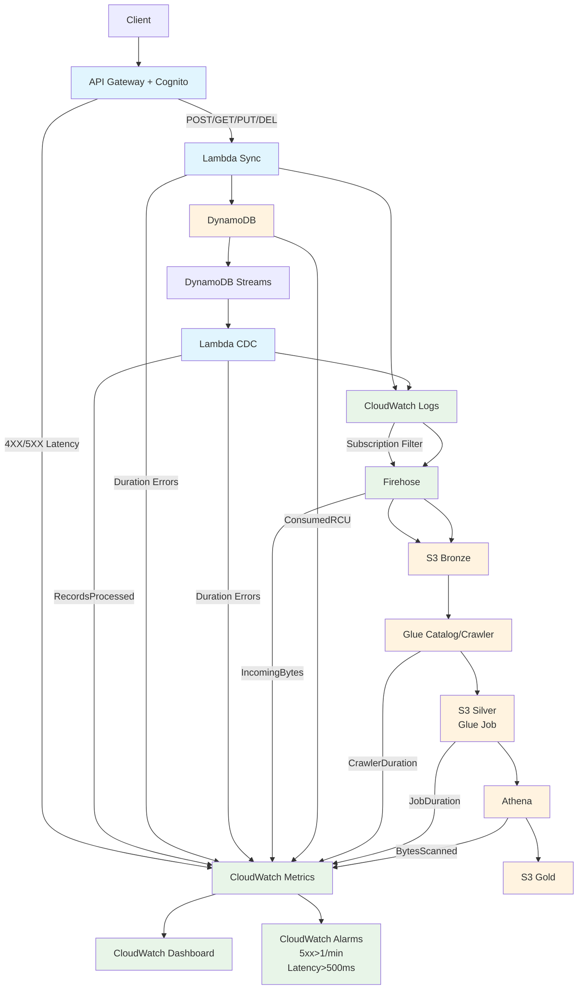

# Todo API with Insights - Consolidated Operations Runbook

**Version**: 1.0  
**Date**: 2025-01-27  
**Branch**: last-chance  

## Table of Contents

1. [Project Overview](#project-overview)
2. [Architecture Summary](#architecture-summary)
3. [Infrastructure Deployment](#infrastructure-deployment)
4. [API Testing and Operations](#api-testing-and-operations)
5. [ETL Pipeline Operations](#etl-pipeline-operations)
6. [Monitoring and Observability](#monitoring-and-observability)
7. [Troubleshooting Guide](#troubleshooting-guide)
8. [Maintenance Procedures](#maintenance-procedures)
9. [Security and Compliance](#security-and-compliance)
10. [Cost Optimization](#cost-optimization)
11. [Emergency Procedures](#emergency-procedures)
12. [Support and Escalation](#support-and-escalation)

---

## Project Overview

The Todo API with Insights is a production-ready serverless application built on AWS that provides:

- **REST API**: FastAPI-based To-Do application with JWT authentication
- **Data Lake**: Complete ETL pipeline with Bronze/Silver/Gold layers
- **Analytics**: Athena-based querying and business intelligence
- **Monitoring**: Comprehensive CloudWatch dashboards and alerting
- **Infrastructure**: AWS CDK-based Infrastructure as Code

### Key Features
- ✅ **Serverless Architecture**: API Gateway, Lambda, DynamoDB, S3, Glue, Athena
- ✅ **Real-time CDC**: DynamoDB Streams → Lambda → Firehose → S3
- ✅ **Data Analytics**: Bronze (raw) → Silver (transformed) → Gold (analytics)
- ✅ **Comprehensive Monitoring**: CloudWatch dashboards, alarms, custom metrics
- ✅ **Production Ready**: Authentication, idempotency, error handling, logging

---

## Architecture Summary

### System Components



### Technology Stack

#### API Layer
- **FastAPI**: Modern Python web framework with automatic OpenAPI documentation
- **5-Layer Architecture**: Entrypoint → Controller → Service → Repository → Database
- **Repository Pattern**: Database abstraction for testability and maintainability
- **Pydantic**: Type-safe request/response validation
- **Mangum**: ASGI adapter for Lambda deployment
- **Lambda Layers**: Shared code across functions

#### Database Layer
- **DynamoDB**: Single-table design with On-Demand capacity
- **Partition Keys**: `USER#{user_id}`, `TASK#{user_id}`, `IDEMPOTENCY#{request_id}`
- **Global Secondary Indexes**: Status, due date, priority, category queries
- **DynamoDB Streams**: Real-time Change Data Capture (CDC)
- **Idempotency**: TTL-based duplicate request handling

#### ETL Pipeline
- **Bronze Layer**: Raw DynamoDB streams and application logs
- **Silver Layer**: Cleaned and transformed data via Glue jobs
- **Gold Layer**: Analytics-optimized business metrics
- **Kinesis Firehose**: Real-time data ingestion with Parquet conversion
- **AWS Glue**: Spark-based ETL jobs for transformations
- **Athena**: Serverless SQL analytics on S3 data

#### Monitoring
- **CloudWatch**: Native AWS monitoring and alerting
- **Structured Logging**: JSON logs with correlation IDs
- **Custom Metrics**: Business KPIs and application metrics
- **SNS**: Alert notifications and escalation

---

## Infrastructure Deployment

### Prerequisites

#### Required Tools
- **AWS CLI** installed and configured
- **CDK CLI** installed: `npm install -g aws-cdk`
- **Python 3.8+** for local development
- **curl** or **Postman** for API testing
- **jq** for JSON parsing (optional but recommended)

#### AWS Permissions
- CDK deployment permissions
- Cognito, Lambda, API Gateway, DynamoDB access
- S3, Glue, Athena, CloudWatch permissions
- IAM role and policy management

### Deployment Steps

#### 1. Bootstrap CDK (First Time Only)
```bash
# Bootstrap CDK in your AWS account (one-time setup per region)
cdk bootstrap aws://YOUR-ACCOUNT-ID/us-east-1
```

#### 2. Deploy Infrastructure Stacks

```bash
# Navigate to infrastructure directory
cd infra

# Activate CDK virtual environment
.\venv-infra\Scripts\Activate.ps1  # Windows
# source venv-infra/bin/activate    # Linux/Mac

# Deploy all stacks in dependency order
cdk deploy TodoDataStack --require-approval never
cdk deploy TodoApiStack --require-approval never
cdk deploy TodoEtlStack --require-approval never
cdk deploy TodoMonitoringStack --require-approval never
```

#### 3. Verify Deployment

**Expected Outputs:**
```bash
✅ TodoDataStack
Outputs:
TodoDataStack.TableName = todo-app-data
TodoDataStack.TableArn = arn:aws:dynamodb:us-east-1:ACCOUNT:table/todo-app-data

✅ TodoApiStack
Outputs:
TodoApiStack.ApiEndpoint = https://API-ID.execute-api.us-east-1.amazonaws.com/
TodoApiStack.UserPoolId = us-east-1_USER-POOL-ID
TodoApiStack.UserPoolClientId = CLIENT-ID

✅ TodoEtlStack
Outputs:
TodoEtlStack.BronzeBucketName = todo-bronze-ACCOUNT-us-east-1
TodoEtlStack.SilverBucketName = todo-silver-ACCOUNT-us-east-1
TodoEtlStack.GoldBucketName = todo-gold-ACCOUNT-us-east-1
TodoEtlStack.FirehoseStreamName = todo-cdc-stream
TodoEtlStack.GlueDatabaseName = todo_analytics
TodoEtlStack.AthenaWorkgroupName = todo-analytics-workgroup

✅ TodoMonitoringStack
Outputs:
TodoMonitoringStack.DashboardUrl = https://console.aws.amazon.com/cloudwatch/home?region=us-east-1#dashboards:name=TodoApiMonitoring
TodoMonitoringStack.AlertTopicArn = arn:aws:sns:us-east-1:ACCOUNT:todo-api-alerts
```

#### 4. Verify Resources in AWS Console

- **DynamoDB**: Table `todo-app-data` with streams enabled
- **API Gateway**: API `todo-api` with Cognito authorizer
- **Lambda**: Functions `todo-api-handler`, `todo-cdc-processor`, `todo-custom-metrics`
- **Cognito**: User pool `todo-api-user-pool`
- **S3**: Buckets for Bronze, Silver, Gold layers
- **Glue**: Database `todo_analytics` and jobs
- **Athena**: Workgroup `todo-analytics-workgroup`
- **CloudWatch**: Dashboard `TodoApiMonitoring`

---

## API Testing and Operations

### Health Check

#### Test Public Health Endpoint
```bash
# Test health endpoint (no authentication required)
curl -X GET https://YOUR-API-ID.execute-api.us-east-1.amazonaws.com/health

# Expected response:
{
  "status": "ok",
  "version": "0.1.0",
  "environment": "production"
}
```

### User Management

#### Create Cognito User
```bash
# Set variables from CDK output
USER_POOL_ID="us-east-1_YOUR-USER-POOL-ID"
CLIENT_ID="YOUR-CLIENT-ID"
USERNAME="testuser@example.com"
PASSWORD="TempPassword123!"

# Create user in Cognito
aws cognito-idp admin-create-user \
  --user-pool-id $USER_POOL_ID \
  --username $USERNAME \
  --user-attributes Name=email,Value=$USERNAME Name=given_name,Value="Test" Name=family_name,Value="User" \
  --message-action SUPPRESS \
  --region us-east-1

# Set permanent password
aws cognito-idp admin-set-user-password \
  --user-pool-id $USER_POOL_ID \
  --username $USERNAME \
  --password $PASSWORD \
  --permanent \
  --region us-east-1
```

#### Authenticate and Get Token
```bash
# Authenticate user and get tokens
AUTH_RESPONSE=$(aws cognito-idp admin-initiate-auth \
  --user-pool-id $USER_POOL_ID \
  --client-id $CLIENT_ID \
  --auth-flow ADMIN_NO_SRP_AUTH \
  --auth-parameters USERNAME=$USERNAME,PASSWORD=$PASSWORD \
  --region us-east-1)

# Extract Id token (required for API calls)
ID_TOKEN=$(echo $AUTH_RESPONSE | jq -r '.AuthenticationResult.IdToken')
echo "IdToken length: ${#ID_TOKEN}"
```

### API Operations

#### Create Task
```bash
# Create a task with idempotency
curl -X POST \
  https://YOUR-API-ID.execute-api.us-east-1.amazonaws.com/api/v1/tasks \
  -H "Authorization: Bearer $ID_TOKEN" \
  -H "Content-Type: application/json" \
  -H "Idempotency-Key: task-creation-123" \
  -d '{
    "title": "Test Task",
    "description": "This is a test task created via API",
    "priority": "medium",
    "category": "testing",
    "status": "pending"
  }' | jq .
```

#### Get Tasks
```bash
# Get all tasks for the user
curl -X GET \
  https://YOUR-API-ID.execute-api.us-east-1.amazonaws.com/api/v1/tasks \
  -H "Authorization: Bearer $ID_TOKEN" | jq .

# Get tasks by status
curl -X GET \
  "https://YOUR-API-ID.execute-api.us-east-1.amazonaws.com/api/v1/tasks?status=pending" \
  -H "Authorization: Bearer $ID_TOKEN" | jq .
```

#### Update Task
```bash
# Update task status
curl -X PUT \
  https://YOUR-API-ID.execute-api.us-east-1.amazonaws.com/api/v1/tasks/TASK-ID \
  -H "Authorization: Bearer $ID_TOKEN" \
  -H "Content-Type: application/json" \
  -H "Idempotency-Key: task-update-456" \
  -d '{
    "status": "in_progress",
    "priority": "high"
  }' | jq .
```

### Automated Testing Scripts

#### PowerShell Script (Windows)
```powershell
# From project root
cd infra\scripts

# Set environment variables
$Env:API_ENDPOINT = "https://YOUR-API-ID.execute-api.us-east-1.amazonaws.com"
$Env:USER_POOL_ID = "us-east-1_YOUR-USER-POOL-ID"
$Env:CLIENT_ID = "YOUR-CLIENT-ID"
$Env:REGION = "us-east-1"
$Env:NON_INTERACTIVE = "1"

# Run automated API testing
./test-api.ps1
```

#### Bash Script (Linux/Mac)
```bash
# From project root
cd infra/scripts

# Set environment variables
export API_ENDPOINT="https://YOUR-API-ID.execute-api.us-east-1.amazonaws.com"
export USER_POOL_ID="us-east-1_YOUR-USER-POOL-ID"
export CLIENT_ID="YOUR-CLIENT-ID"
export REGION="us-east-1"
export NON_INTERACTIVE=1

# Make script executable (first time only)
chmod +x test-api.sh

# Run automated API testing
./test-api.sh
```

### ETL Testing Scripts

#### PowerShell ETL Script (Windows)
```powershell
# Set ETL testing variables
$Env:NUM_USERS = "3"
$Env:TASKS_PER_USER = "5"
$Env:UPDATES_PER_TASK = "3"

# Run ETL data generation
./test-etl.ps1
```

#### Bash ETL Script (Linux/Mac)
```bash
# Set ETL testing variables
export NUM_USERS="3"
export TASKS_PER_USER="5"
export UPDATES_PER_TASK="3"

# Run ETL data generation
./test-etl.sh
```

---

## ETL Pipeline Operations

### Data Flow Overview

#### Bronze Layer (Raw Data)
- **Source**: DynamoDB Streams + CloudWatch Logs
- **Ingestion**: Kinesis Firehose with 60-second buffering
- **Format**: Parquet with Snappy compression
- **Partitioning**: `year=YYYY/month=MM/day=DD/user_id=xxx/`
- **Storage**: S3 Bronze bucket with lifecycle policies

#### Silver Layer (Transformed Data)
- **Processing**: Glue Spark jobs
- **Transformation**: 
  - CDC event processing and normalization
  - User and task entity extraction
  - Data quality validation
  - Schema evolution handling
- **Output**: Optimized Parquet files for Athena queries

#### Gold Layer (Analytics Data)
- **Processing**: Glue analytics jobs
- **Analytics**:
  - User engagement metrics
  - Task completion trends
  - Business KPIs and insights
  - Category-based analytics
- **Output**: Business-ready datasets for reporting

### ETL Operations

#### 1. Enable DynamoDB Streams
```bash
# Verify streams are enabled
aws dynamodb describe-table --table-name todo-app-data --region us-east-1 | jq '.Table.StreamSpecification'
```

#### 2. Monitor Data Ingestion
```bash
# Check Bronze layer data
aws s3 ls s3://todo-bronze-YOUR-ACCOUNT-us-east-1/cdc/ --region us-east-1

# Check Firehose delivery stream
aws firehose describe-delivery-stream --delivery-stream-name todo-cdc-stream --region us-east-1
```

#### 3. Run Glue Jobs

##### Silver Transformation Job
```bash
# Start Silver transformation job
aws glue start-job-run \
  --job-name todo-silver-transformation \
  --arguments '{
    "--BRONZE_BUCKET": "todo-bronze-YOUR-ACCOUNT-us-east-1",
    "--SILVER_BUCKET": "todo-silver-YOUR-ACCOUNT-us-east-1",
    "--DATABASE_NAME": "todo_analytics"
  }' \
  --region us-east-1
```

##### Gold Analytics Job
```bash
# Start Gold analytics job
aws glue start-job-run \
  --job-name todo-gold-analytics \
  --arguments '{
    "--SILVER_BUCKET": "todo-silver-YOUR-ACCOUNT-us-east-1",
    "--GOLD_BUCKET": "todo-gold-YOUR-ACCOUNT-us-east-1",
    "--DATABASE_NAME": "todo_analytics"
  }' \
  --region us-east-1
```

#### 4. Monitor Job Execution
```bash
# Check job run status
aws glue get-job-run --job-name todo-silver-transformation --run-id RUN-ID --region us-east-1

# Check job logs
aws logs tail /aws/logs/aws-glue/jobs/error --region us-east-1
```

### Athena Analytics

#### Create Tables
```bash
# Create user analytics table
aws athena start-query-execution \
  --query-string "CREATE EXTERNAL TABLE IF NOT EXISTS user_analytics (user_id string, email string, name string, first_seen bigint, last_updated bigint, total_events bigint, max_event_types bigint) STORED AS PARQUET LOCATION 's3://todo-gold-YOUR-ACCOUNT-us-east-1/user_analytics/' TBLPROPERTIES ('has_encrypted_data'='false')" \
  --query-execution-context Database=todo_analytics \
  --result-configuration OutputLocation=s3://todo-gold-YOUR-ACCOUNT-us-east-1/athena-results/ \
  --region us-east-1
```

#### Query Analytics Data
```bash
# Query user analytics
aws athena start-query-execution \
  --query-string "SELECT COUNT(*) as total_users FROM user_analytics" \
  --query-execution-context Database=todo_analytics \
  --result-configuration OutputLocation=s3://todo-gold-YOUR-ACCOUNT-us-east-1/athena-results/ \
  --region us-east-1

# Get query results
aws athena get-query-results --query-execution-id QUERY-ID --region us-east-1
```

### ETL Monitoring

#### Daily Operations
1. **Check ETL Pipeline Health**
   - Review CloudWatch dashboard for job success rates
   - Monitor data ingestion volumes
   - Check storage usage trends
   - Review error rates and alerts

2. **Monitor Data Quality**
   - Review data quality metrics
   - Check for missing or null values
   - Verify data format validation
   - Monitor schema compliance

3. **Verify Data Lake Structure**
   - Check S3 bucket contents
   - Verify Bronze layer has raw CDC events
   - Confirm Silver layer has transformed data
   - Validate Gold layer has analytics data

#### Weekly Operations
1. **Review ETL Job Performance**
   - Analyze Glue job execution times
   - Check for performance degradation
   - Review error logs and patterns
   - Optimize job configurations if needed

2. **Data Lake Maintenance**
   - Review storage costs and usage
   - Check data retention policies
   - Verify partitioning strategies
   - Clean up temporary files

3. **Schema Evolution**
   - Review schema changes in source data
   - Update Glue table definitions
   - Test schema compatibility
   - Update ETL job logic if needed

---

## Monitoring and Observability

### CloudWatch Dashboard

#### Dashboard Sections

1. **API Health Overview**
   - Request counts (Sum)
   - 4XX/5XX errors (Sum)
   - API latency (Average)

2. **Lambda Performance**
   - Duration (Average)
   - Errors (Sum)
   - Throttles (Sum)
   - Invocations (Sum)

3. **ETL Pipeline Health**
   - Firehose delivery success (Sum)
   - Data freshness (Average)
   - Glue job completion/failure (Sum)

4. **Database Performance**
   - Read/Write capacity units (Sum)
   - Throttled requests (Sum)
   - Request latency (Average)

5. **Business Metrics**
   - Total users, active users (Maximum)
   - Total tasks, completed tasks (Maximum)
   - Completion rate, avg tasks per user (Maximum)

6. **Cost Monitoring**
   - Service costs by AWS service (Maximum)

#### Access Dashboard
```bash
# Dashboard URL (from CDK output)
https://console.aws.amazon.com/cloudwatch/home?region=us-east-1#dashboards:name=TodoApiMonitoring
```

### CloudWatch Alarms

#### Critical Alarms
- **API Error Rate**: >10 4XX errors over 2 evaluation periods
- **Lambda Errors**: >5 errors over 1 evaluation period
- **Lambda Duration**: >5000ms over 2 evaluation periods
- **Firehose Failures**: >1 delivery failure
- **Glue Job Failures**: >1 failed task

#### Cost Alarms
- **DynamoDB Costs**: >$50 threshold
- **Lambda Costs**: >$20 threshold

#### Check Alarm Status
```bash
# List CloudWatch alarms
aws cloudwatch describe-alarms --region us-east-1 | jq '.MetricAlarms[] | select(.AlarmName | contains("todo"))'
```

### Custom Metrics

#### Business Metrics Collection
```bash
# Check custom metrics Lambda function
aws lambda get-function --function-name todo-custom-metrics --region us-east-1

# List custom metrics
aws cloudwatch list-metrics --namespace "TodoApi/CustomMetrics" --region us-east-1
```

#### Metrics Published
- **TotalUsers**: Total number of users in system
- **ActiveUsers**: Users with recent activity
- **TotalTasks**: Total number of tasks created
- **CompletedTasks**: Number of completed tasks
- **CompletionRate**: Task completion percentage
- **AvgTasksPerUser**: Average tasks per user

### Structured Logging

#### Log Format Standard
```json
{
  "timestamp": "2025-01-27T10:30:45.123Z",
  "level": "INFO",
  "request_id": "abc-123-def-456",
  "user_id": "user-789",
  "component": "api-gateway|lambda-sync|lambda-cdc",
  "operation": "create-task|update-task|query-tasks|process-cdc",
  "duration_ms": 150,
  "status": "success|error",
  "message": "Task created successfully",
  "metadata": {
    "task_id": "task-123",
    "table_name": "todo-app-data"
  }
}
```

#### View Logs
```bash
# View Lambda function logs
aws logs tail /aws/lambda/todo-api-handler --region us-east-1 --follow

# View CDC Lambda logs
aws logs tail /aws/lambda/todo-cdc-processor --region us-east-1 --follow

# View custom metrics Lambda logs
aws logs tail /aws/lambda/todo-custom-metrics --region us-east-1 --follow
```

---

## Troubleshooting Guide

### Common Issues

#### 1. API Gateway Issues

**Symptoms**: `{"message":"Not Found"}` on health endpoint

**Causes**:
- API Gateway route not configured correctly
- Lambda function not deployed properly

**Resolution**:
```bash
# Check API Gateway routes
aws apigatewayv2 get-routes --api-id YOUR-API-ID --region us-east-1

# Check Lambda function logs
aws logs tail /aws/lambda/todo-api-handler --region us-east-1

# Redeploy API stack
cdk deploy TodoApiStack --require-approval never
```

#### 2. Authentication Failures

**Symptoms**: `401 Unauthorized` or token-related errors

**Causes**:
- Invalid or expired token
- Incorrect User Pool/Client configuration

**Resolution**:
```bash
# Verify Cognito configuration
aws cognito-idp describe-user-pool --user-pool-id $USER_POOL_ID --region us-east-1

# Check user exists
aws cognito-idp list-users --user-pool-id $USER_POOL_ID --region us-east-1

# Regenerate token
# Follow authentication steps in API Testing section
```

#### 3. Lambda Function Errors

**Symptoms**: `500 Internal Server Error`

**Causes**:
- Import errors in Lambda function
- Missing dependencies
- DynamoDB access issues

**Resolution**:
```bash
# Check Lambda function logs for detailed error messages
aws logs tail /aws/lambda/todo-api-handler --region us-east-1

# Verify function configuration
aws lambda get-function --function-name todo-api-handler --region us-east-1

# Check DynamoDB table exists
aws dynamodb describe-table --table-name todo-app-data --region us-east-1
```

#### 4. ETL Pipeline Issues

**Symptoms**: No data in Bronze/Silver/Gold layers

**Causes**:
- DynamoDB streams not enabled
- Firehose delivery failures
- Lambda CDC function errors
- Glue job failures

**Resolution**:
```bash
# Check DynamoDB streams
aws dynamodb describe-table --table-name todo-app-data --region us-east-1 | jq '.Table.StreamSpecification'

# Check Firehose delivery stream
aws firehose describe-delivery-stream --delivery-stream-name todo-cdc-stream --region us-east-1

# Check CDC Lambda logs
aws logs tail /aws/lambda/todo-cdc-processor --region us-east-1

# Check Glue job status
aws glue get-job-run --job-name todo-silver-transformation --run-id RUN-ID --region us-east-1
```

#### 5. Data Quality Issues

**Symptoms**: Validation failures, incomplete data

**Causes**:
- Schema mismatches
- Data format changes
- Missing required fields
- Data corruption

**Resolution**:
```bash
# Review data quality rules
# Check source data schema
# Update validation logic
# Fix source data issues
# Reprocess affected data
```

### Debugging Commands

```bash
# Check all API Gateway APIs
aws apigatewayv2 get-apis --region us-east-1

# Check Lambda function configuration
aws lambda get-function --function-name todo-api-handler --region us-east-1 | jq '.Configuration'

# Check CloudWatch log groups
aws logs describe-log-groups --log-group-name-prefix /aws/lambda --region us-east-1

# Check Cognito user pools
aws cognito-idp list-user-pools --max-results 10 --region us-east-1

# Check DynamoDB tables
aws dynamodb list-tables --region us-east-1

# Check S3 buckets
aws s3 ls --region us-east-1

# Check Glue jobs
aws glue get-jobs --region us-east-1 | jq '.JobList[] | select(.Name | contains("todo"))'

# Check Athena workgroup
aws athena get-work-group --work-group todo-analytics-workgroup --region us-east-1
```

---

## Maintenance Procedures

### Regular Maintenance

#### Daily Operations
1. **Check System Health**
   - Review CloudWatch dashboard
   - Check alarm status
   - Monitor error rates
   - Review performance metrics

2. **Data Quality Monitoring**
   - Check ETL job success rates
   - Monitor data ingestion volumes
   - Verify data completeness
   - Review validation results

3. **Cost Monitoring**
   - Check daily AWS costs
   - Monitor resource usage
   - Review cost allocation tags
   - Check budget alerts

#### Weekly Operations
1. **Performance Review**
   - Analyze API response times
   - Review Lambda performance
   - Check ETL job execution times
   - Monitor database performance

2. **Data Lake Maintenance**
   - Review storage usage
   - Check data retention policies
   - Verify partitioning strategies
   - Clean up temporary files

3. **Security Review**
   - Check access logs
   - Review IAM permissions
   - Verify encryption settings
   - Check compliance status

#### Monthly Operations
1. **Capacity Planning**
   - Review storage growth trends
   - Plan for scaling requirements
   - Optimize cost structures
   - Update lifecycle policies

2. **Schema Evolution**
   - Review schema changes
   - Update Glue table definitions
   - Test compatibility
   - Update ETL logic

3. **Backup and Recovery**
   - Test backup procedures
   - Verify recovery processes
   - Update disaster recovery plans
   - Document changes

### Backup and Recovery

#### Data Backup
- **S3 Versioning**: Enabled on all data lake buckets
- **Cross-Region Replication**: Configured for critical data
- **Point-in-Time Recovery**: Enabled on DynamoDB table
- **Regular Backup Testing**: Monthly verification

#### Disaster Recovery
- **Multi-Region Deployment**: Available for critical components
- **Automated Failover**: Configured for API Gateway
- **Data Replication**: Real-time replication for DynamoDB
- **Recovery Procedures**: Documented and tested

---

## Security and Compliance

### Access Control

#### IAM Policies
- **Least Privilege**: Minimal required permissions
- **Role-Based Access**: Separate roles for different functions
- **Regular Reviews**: Monthly access permission audits
- **Audit Logging**: All access attempts logged

#### Authentication
- **JWT Tokens**: Secure token-based authentication
- **Cognito Integration**: Managed user authentication
- **Token Expiration**: Configurable token lifetimes
- **Refresh Tokens**: Secure token renewal

### Data Protection

#### Encryption
- **At Rest**: S3 and DynamoDB encryption enabled
- **In Transit**: TLS/SSL for all communications
- **Key Management**: AWS KMS for encryption keys
- **Data Masking**: Sensitive data protection

#### Compliance
- **Data Retention**: Configurable retention policies
- **Audit Trails**: Comprehensive logging
- **Privacy Controls**: User data protection
- **Regulatory Compliance**: Industry standard compliance

### Monitoring

#### Security Monitoring
- **Access Pattern Analysis**: Unusual access detection
- **Anomaly Detection**: Automated threat detection
- **Incident Response**: Documented response procedures
- **Security Alerts**: Real-time security notifications

---

## Cost Optimization

### Storage Optimization

#### S3 Lifecycle Policies
- **Standard to IA**: After 30 days
- **IA to Glacier**: After 90 days
- **Glacier to Deep Archive**: After 365 days
- **Automatic Deletion**: After 7 years

#### Data Compression
- **Parquet Format**: Columnar compression
- **Snappy Compression**: Fast compression algorithm
- **Partitioning**: Efficient data organization
- **Archival Strategies**: Cost-effective long-term storage

### Compute Optimization

#### Lambda Optimization
- **Right-Sizing**: Appropriate memory allocation
- **Provisioned Concurrency**: For critical functions
- **Dead Letter Queues**: Error handling
- **Reserved Concurrency**: Cost control

#### Glue Job Optimization
- **DPU Optimization**: Right-sized compute resources
- **Spot Instances**: Cost-effective processing
- **Job Scheduling**: Efficient resource utilization
- **Auto-Scaling**: Dynamic resource allocation

### Cost Monitoring

#### Budget Alerts
- **Monthly Budgets**: Set for each service
- **Cost Thresholds**: Alert at 80% and 100%
- **Usage Analysis**: Regular cost reviews
- **Optimization Recommendations**: Automated suggestions

#### Cost Allocation
- **Resource Tagging**: Project, Owner, Environment, CostCenter
- **Cost Centers**: Engineering platform allocation
- **Usage Tracking**: Detailed usage monitoring
- **Cost Reporting**: Regular cost reports

---

## Emergency Procedures

### ETL Pipeline Failure

#### Immediate Response
1. **Check CloudWatch Alarms**
   - Review active alarms
   - Identify root cause
   - Notify stakeholders
   - Document incident

2. **Recovery Steps**
   - Fix underlying issue
   - Restart failed jobs
   - Verify data integrity
   - Monitor for stability

3. **Post-Incident**
   - Document incident details
   - Update procedures
   - Implement improvements
   - Conduct post-mortem

### Data Loss Prevention

#### Immediate Response
1. **Stop ETL Jobs**
   - Preserve current state
   - Assess data loss scope
   - Notify stakeholders
   - Document incident

2. **Recovery Steps**
   - Restore from backups
   - Reprocess missing data
   - Verify data integrity
   - Resume normal operations

3. **Post-Incident**
   - Document incident details
   - Update backup procedures
   - Implement monitoring
   - Conduct post-mortem

### API Service Outage

#### Immediate Response
1. **Check Service Status**
   - Review CloudWatch metrics
   - Check Lambda function logs
   - Verify DynamoDB status
   - Notify stakeholders

2. **Recovery Steps**
   - Restart failed services
   - Verify API functionality
   - Check data consistency
   - Monitor for stability

3. **Post-Incident**
   - Document incident details
   - Update procedures
   - Implement improvements
   - Conduct post-mortem

---

## Appendix

### A. Glossary

#### Technical Terms
- **API Gateway**: AWS service for API management
- **Athena**: AWS serverless query service
- **Bronze Layer**: Raw data storage in data lake
- **CDC**: Change Data Capture
- **CloudWatch**: AWS monitoring and observability service
- **Cognito**: AWS user authentication service
- **DynamoDB**: AWS NoSQL database service
- **ETL**: Extract, Transform, Load
- **Firehose**: Kinesis Data Firehose for data ingestion
- **Glue**: AWS ETL service
- **Gold Layer**: Analytics-optimized data
- **Lambda**: AWS serverless compute service
- **Repository Pattern**: Database abstraction design pattern
- **Silver Layer**: Cleaned and transformed data
- **S3**: AWS object storage service

#### Business Terms
- **KPI**: Key Performance Indicator
- **SLA**: Service Level Agreement
- **SLO**: Service Level Objective
- **MTTR**: Mean Time To Recovery
- **MTBF**: Mean Time Between Failures

### B. Reference Links

#### AWS Documentation
- [API Gateway Documentation](https://docs.aws.amazon.com/apigateway/)
- [Lambda Documentation](https://docs.aws.amazon.com/lambda/)
- [DynamoDB Documentation](https://docs.aws.amazon.com/dynamodb/)
- [S3 Documentation](https://docs.aws.amazon.com/s3/)
- [Glue Documentation](https://docs.aws.amazon.com/glue/)
- [Athena Documentation](https://docs.aws.amazon.com/athena/)
- [CloudWatch Documentation](https://docs.aws.amazon.com/cloudwatch/)
- [Cognito Documentation](https://docs.aws.amazon.com/cognito/)

#### Technology Documentation
- [FastAPI Documentation](https://fastapi.tiangolo.com/)
- [Pydantic Documentation](https://docs.pydantic.dev/)
- [AWS CDK Documentation](https://docs.aws.amazon.com/cdk/)
- [Mangum Documentation](https://mangum.readthedocs.io/)

### C. Troubleshooting Checklists

#### API Issues Checklist
- [ ] Check API Gateway routes
- [ ] Verify Lambda function logs
- [ ] Check DynamoDB table status
- [ ] Verify Cognito configuration
- [ ] Check IAM permissions
- [ ] Review CloudWatch metrics

#### ETL Issues Checklist
- [ ] Check DynamoDB streams status
- [ ] Verify Firehose delivery stream
- [ ] Check Lambda CDC function logs
- [ ] Review Glue job status
- [ ] Check S3 bucket permissions
- [ ] Verify Athena workgroup

#### Performance Issues Checklist
- [ ] Check Lambda function performance
- [ ] Review DynamoDB capacity usage
- [ ] Check ETL job execution times
- [ ] Verify S3 storage usage
- [ ] Review CloudWatch metrics
- [ ] Check cost optimization

#### Security Issues Checklist
- [ ] Check IAM permissions
- [ ] Verify encryption settings
- [ ] Review access logs
- [ ] Check compliance status
- [ ] Verify token security
- [ ] Review security alerts

---

**Document Version**: 1.0  
**Last Updated**: 2025-01-27  
**Next Review**: 2025-02-27  
**Maintained By**: Development Team
